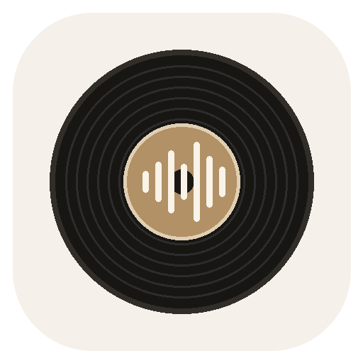
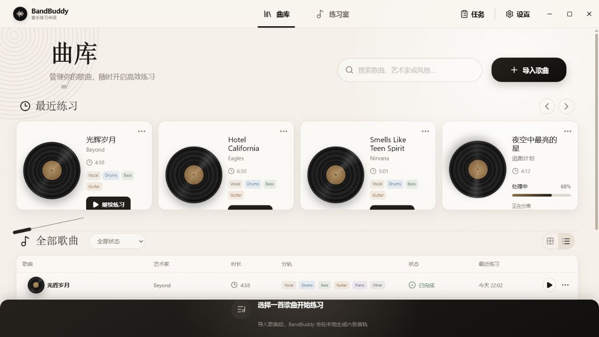
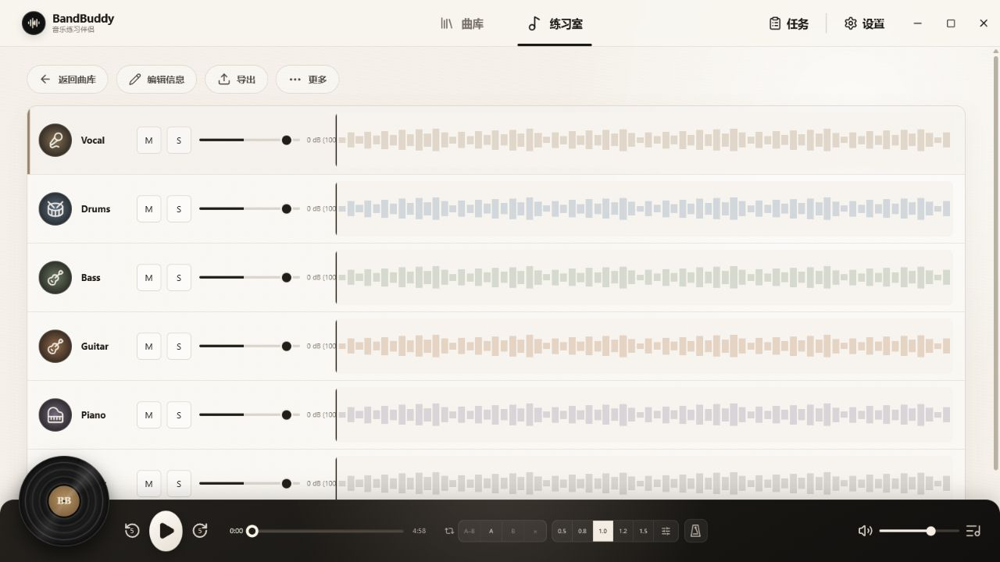

<div align="center">
  
  <h1>BandBuddy</h1>
  <p><strong>把一首歌拆成可以反复练的六条轨道。</strong></p>
  <p>面向乐手的本地优先桌面练琴工作台 · Local-first practice workstation for musicians.</p>
  <p>
    <a href="https://github.com/dourgey/BandBuddy/releases/latest"></a>
    <a href="https://github.com/dourgey/BandBuddy/actions/workflows/windows.yml"></a>
    <a href="https://github.com/dourgey/BandBuddy/actions/workflows/macos.yml"></a>
    <a href="./LICENSE"></a>
    
  </p>
</div>

BandBuddy 的核心不是“把人声去掉”，而是让一首歌真正变得**可练**：听清目标声部、放慢困难小节、循环到肌肉记住、跟着准确节拍进入，再在下一次打开时从原来的位置继续。

> [下载最新正式版](https://github.com/dourgey/BandBuddy/releases/latest) · 当前版本 `1.0.0` · Windows x64 正式发布，macOS x64 / Apple Silicon 持续构建

## 从听歌到练琴


BandBuddy 把一次有效练习整理成一条很短的路径：**选歌 → 分轨 → 聚焦 → 慢练 → 循环 → 合奏**。账号、云曲库和联网播放器都不是这条路径的前提；音乐、模型、练习状态和导出结果都留在你的电脑上。

## 界面



曲库会记住最近练过什么、练到哪里，并把分轨任务状态、收藏和搜索放在同一个入口。截图使用演示数据，项目不附带其中的音乐。



练习室让 Vocal、Drums、Bass、Guitar、Piano、Other 六轨共用一条播放时钟和同一段 A–B 区间，所有调整都会自动保存。

## 为练琴准备的功能

### 听清每一个声部

- 使用本地 Demucs 模型生成 `Vocal / Drums / Bass / Guitar / Piano / Other` 六轨。
- 六条同步波形可独立 `Mute`、`Solo` 和调节增益，另有主音量控制。
- 可以直接导入已有分轨；BandBuddy 会按常见中英文文件名识别声部，也允许在导入前手动修正。
- Piano 是实验性声部；复杂编曲里可能与 Guitar 或 Other 串音，界面会持续提示这一点。

### 把难点缩小，反复练会

- 在波形上选择区间，或使用 A / B 按钮设置循环；循环开关和边界会随歌曲保存。
- 提供 `0.5× / 0.8× / 1.0× / 1.2× / 1.5×` 快捷速度，以及 `0.20×–4.00×` 无级变速，播放时保持音高。
- 六轨由同一主时钟校正，变速、跳转和循环时仍保持同步。
- 播放位置、速度、循环、每轨 Mute/Solo/增益、缩放与滚动视图都会自动保存。

### 跟上节拍再进入

- 可优先分析鼓轨自动检测 BPM，也可以手动修改。
- 内置节拍器支持拍点提前/延后微调，并随播放速度同步。
- 支持关闭、4 拍或 8 拍预备拍，让手和乐器先准备好再进入歌曲。

### 管理自己的练习曲库

- 导入 `MP3 / WAV / FLAC / M4A / AAC`，并兼容用户有权使用的本地 `.ncm` 文件。
- 搜索歌曲或艺术家，按收藏、处理中、最近练习筛选，并在列表/卡片布局间切换。
- 后台任务展示分轨、标准化和导出进度；支持取消、重试，以及显存不足后的 CPU 重试。
- 可编辑标题、艺术家、BPM、调号与拍号；删除的受管歌曲会先进入系统废纸篓 / 回收站。

### 带走分轨或当前练习混音

- 分别导出所选标准分轨，或导出应用了 Mute、Solo、每轨增益与主增益的当前混音。
- 当前混音可选择应用练习速度、只导出 A–B 区间，并在输出前限制峰值避免削波。
- 支持 `WAV / FLAC`（44.1 kHz、24-bit）和 `MP3`（320 kbps）。

## 常用快捷键

| 按键 | 操作 |
| --- | --- |
| `Space` | 播放 / 暂停 |
| `←` / `→` | 后退 / 前进 5 秒；按住 `Shift` 时为 1 秒 |
| `↑` / `↓` | 选择上一条 / 下一条音轨 |
| `M` / `S` | 切换当前音轨的 Mute / Solo |
| `+` / `-` / `0` | 当前音轨增益 +1 dB / -1 dB / 归零 |
| `A` / `B` / `L` | 设置循环起点 / 终点 / 切换 A–B 循环 |
| `Esc` | 清除循环区间 |

## 本地优先

- **无需上传音乐**：分轨、波形、BPM 检测、混音与导出全部在本机完成。
- **独立运行环境**：应用安装私有 CPython、PyTorch 和 Demucs，不读取系统 Python、PATH 或注册表 Python。
- **按设备自动回退**：Windows 优先使用可用的 NVIDIA CUDA，macOS 优先使用 Apple MPS；不可用、设备失效或显存不足时可回退 CPU。
- **可验证的依赖**：uv、FFmpeg 和模型按固定版本下载并校验 SHA-256；代理凭据会从日志中脱敏。
- **可恢复的数据操作**：SQLite 使用 WAL 和迁移备份；重新分轨成功前保留旧版本，删除音乐时先移动到回收站。

首次使用 AI 分轨前，需要在设置中安装本地环境。请预留约 **8–15 GB** 空间；安装会下载私有 Python、Torch 与约 1 GB 模型，支持取消和从缓存续传。只导入现有分轨时不需要安装 Demucs 环境。

## 安装 Windows 版

前往 [Releases](https://github.com/dourgey/BandBuddy/releases/latest)，按需要下载：

- `BandBuddy-1.0.0-x64.exe`：安装版，可选择安装位置并创建桌面/开始菜单快捷方式。
- `BandBuddy-1.0.0-x64-portable.exe`：便携版，不写入安装目录。
- `SHA256SUMS.txt`：用于校验下载文件完整性。

开源 CI 在没有 Authenticode 证书时会发布**未签名**构建，Windows SmartScreen 可能显示“未知发布者”。Release 说明会标明该版本是否已签名；如果你不接受未签名程序，可从源码构建，或等待 Microsoft Store / 已签名版本。

## 安装 macOS 持续构建

[macOS CI](./.github/workflows/macos.yml) 会分别在 Intel 与 Apple Silicon 原生 runner 上生成 `DMG` 和 `ZIP`：

- `BandBuddy-1.0.0-macos-x64.dmg` / `.zip`：Intel Mac。
- `BandBuddy-1.0.0-macos-arm64.dmg` / `.zip`：Apple Silicon Mac。

在对应的 Actions 运行页下载 artifact。当前 macOS 构建尚未使用 Apple Developer ID 签名或公证，Gatekeeper 会提示开发者身份无法验证；请先核对同一 artifact 内的 SHA-256 文件。后续推送新版本标签时，Release workflow 也会自动附加两个架构的 macOS 包。

## 从源码运行

需要 Windows 10/11 x64 或 macOS（Intel / Apple Silicon）、Node.js 24+ 与 pnpm 11+。系统无需预装 Python、Torch、CUDA Toolkit 或 FFmpeg。

```powershell
git clone https://github.com/dourgey/BandBuddy.git
cd BandBuddy
pnpm install
pnpm tools:fetch
pnpm test
pnpm dev
```

`pnpm tools:fetch` 会下载并逐文件校验固定版本的 uv 与 FFmpeg。只查看界面时可运行 `pnpm dev:renderer`，然后打开 `http://localhost:5173/?fixtures=1`；fixture 模式只在开发环境启用，不会进入正式构建。

### 构建 Windows 包

```powershell
pnpm package:dir       # 未签名的解包目录：release-unsigned/win-unpacked
pnpm package:unsigned  # 未签名安装版 + 便携版：release-unsigned
pnpm package           # 需要 Authenticode 证书的正式签名包：release
pnpm package:store     # Microsoft Store AppX：release-store
```

签名构建通过 `WIN_CSC_LINK` 与 `WIN_CSC_KEY_PASSWORD` 向 electron-builder 提供 PFX/P12 证书。`pnpm package` 会在证书缺失、签名无效或任一 `.exe/.dll/.node` 未签名时失败。

### 构建 macOS 包

```bash
pnpm package:mac:dir  # 当前架构的未签名 .app 目录
pnpm package:mac      # 当前架构的未签名 DMG + ZIP
```

macOS 包必须在对应架构的 Mac 上构建，以便 Electron、`better-sqlite3`、uv 和 FFmpeg 保持同一架构。

## CI 与 Release

- [Windows CI](./.github/workflows/windows.yml) 在 `main`、Pull Request 和手动运行时执行资源校验、类型检查、测试与未签名 Electron 打包，并保存构建产物。
- [macOS CI](./.github/workflows/macos.yml) 使用 Intel 与 Apple Silicon 原生 runner 并行测试，验证包内 uv / FFmpeg 架构后保存 DMG、ZIP 与 SHA-256 文件。
- [Release workflow](./.github/workflows/release.yml) 在推送与 `package.json` 版本一致的 `v*` 标签时自动打包 Windows x64、macOS x64 与 macOS arm64，生成 SHA-256 校验文件并创建 GitHub Release。
- 如果仓库配置了 `WINDOWS_CSC_LINK` 和 `WINDOWS_CSC_KEY_PASSWORD`，Release workflow 会生成并验证签名包；否则会明确发布未签名社区构建。

## 项目结构

| 路径 | 职责 |
| --- | --- |
| `src/main` | Electron 主进程、SQLite、任务队列、导入/导出与安全边界 |
| `src/preload` | 经过约束的 renderer ↔ main IPC 桥 |
| `src/renderer` | React 曲库、练习室、多轨播放器与波形界面 |
| `python/worker` | 本地 Demucs 工作进程及模型下载协议 |
| `packages/shared` | 领域类型、Zod schema 与 IPC 合约 |
| `resources` / `scripts` | 固定桌面工具清单、下载和验证脚本 |
| `tests` | 音频规则、迁移、路径安全、任务状态和播放器测试 |

更详细的进程边界、数据原子性、音频管线和 worker 协议见 [架构说明](./docs/ARCHITECTURE.md)。第三方组件及许可见 [THIRD_PARTY_NOTICES.md](./THIRD_PARTY_NOTICES.md)。

## 当前边界

`1.0.0` 的正式 Release 目前只包含 Windows x64；macOS x64 / arm64 先通过 CI 提供未签名预览，后续版本标签会自动加入 Release。目前不包含账号/云同步、Web 端、录音、变调、歌单、歌词或自动更新；Piano 分轨仍为实验性功能。欢迎通过 [Issues](https://github.com/dourgey/BandBuddy/issues) 提交可复现的问题和练琴场景建议。

## 许可与音频权利

BandBuddy 源码使用 [Apache License 2.0](./LICENSE)。第三方工具、库和模型保留各自许可。BandBuddy 不附带音乐；请只导入、处理和导出你拥有或已获授权使用的音频。
