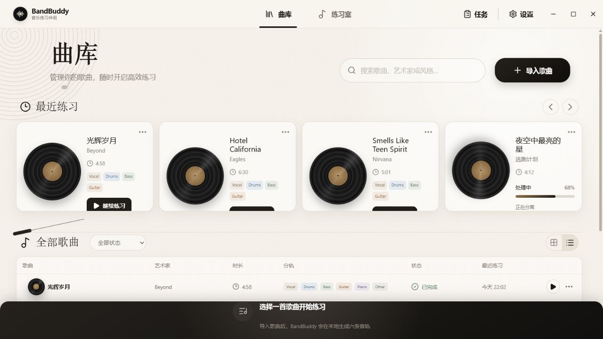
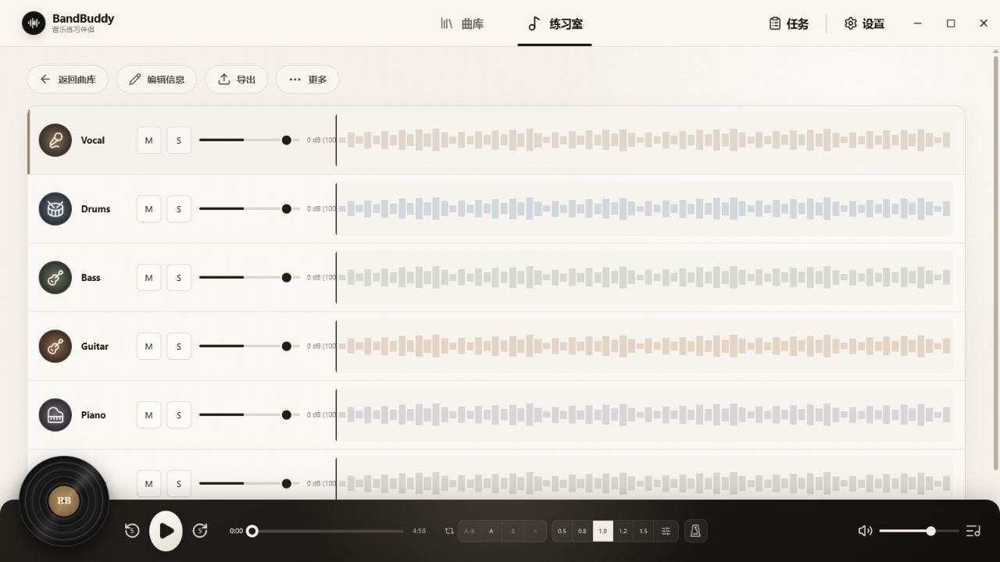

<div align="center">
  
  <h1>BandBuddy</h1>
  <p><strong>把一首歌拆成可以反复练的九条轨道。</strong></p>
  <p>面向乐手的本地优先桌面练琴工作台 · Local-first practice workstation for musicians.</p>
  <p>
    <a href="https://github.com/dourgey/BandBuddy/releases/latest"></a>
    <a href="https://github.com/dourgey/BandBuddy/actions/workflows/windows.yml"></a>
    <a href="https://github.com/dourgey/BandBuddy/actions/workflows/macos.yml"></a>
    <a href="./LICENSE"></a>
    
  </p>
</div>

BandBuddy 的核心不是“把人声去掉”，而是让一首歌真正变得**可练**：听清目标声部、放慢困难小节、循环到肌肉记住、跟着准确节拍进入，再在下一次打开时从原来的位置继续。

> [项目主页](https://bandbuddy.lonelyme.cn/) · [下载最新正式版](https://github.com/dourgey/BandBuddy/releases/latest) · [隐私说明](https://bandbuddy.lonelyme.cn/privacy.html) · 源码版本 `2.0.0` · Windows x64 / macOS Apple Silicon

## 从听歌到练琴


```mermaid
flowchart LR
  A["导入歌曲"] --> B["本地一次生成九条音轨"]
  B --> C["听清：Mute / Solo / 增益"]
  C --> D["拆练：变速 / 升降调 / A–B 循环"]
  D --> E["练准：BPM / 节拍器 / 预备拍"]
  E --> F["录下：多轨 Take / 整场排练"]
  F --> G["自动保存，下次继续"]
  G --> H["导出分轨或练习混音"]
```

BandBuddy 把一次有效练习整理成一条很短的路径：**选歌 → 分轨 → 聚焦 → 慢练 → 循环 → 合奏**。账号、云曲库和联网播放器都不是这条路径的前提；音乐、模型、练习状态和导出结果都留在你的电脑上。

## 界面



曲库会记住最近练过什么、练到哪里，并把分轨任务状态、收藏和搜索放在同一个入口。截图使用演示数据，项目不附带其中的音乐。



练习室让已生成的分轨共用一条播放时钟和同一段 A–B 区间。HTDemucs 六轨完成后歌曲就能开始练习，三条吉他细分轨会在后台继续生成；期间“吉他分轨”按钮会显示等待说明，完成后在按钮旁即时通知。打开该模式时，原 Guitar 自动静音并隐藏，切换为 Acoustic、Lead、Rhythm 三轨。所有调整都会自动保存。

## 为练琴准备的功能

### 听清每一个声部

- 分轨分成两个持久化阶段：先生成 `Vocal / Drums / Bass / Guitar / Piano / Other` 六轨并开放练习室，再在后台补齐 `Acoustic / Lead / Rhythm`。
- 原六轨模式和吉他细分模式即时切换；隐藏备选轨不参与 Solo、独立输出、快捷键选择或默认混音导出。
- 当前模式的同步波形可独立 `Mute`、`Solo` 和调节增益，另有主音量控制。
- 选择多通道输出设备后，每条分轨可独立路由到 `1–2 / 3–4 / …` 立体声通道对，便于通过 Loopback 等虚拟声卡送入 DAW。
- macOS 下选择 Loopback 时会自动修复其全部为“未知”的声道标签，避免 8 路设备被识别为 2 路；保留已配置的声道布局。单声道素材在所选立体声通道对中居中播放。
- Piano 是实验性声部；复杂编曲里可能与 Guitar 或 Other 串音，界面会持续提示这一点。

### 把难点缩小，反复练会

- 在波形上选择区间，或连续点击同一个 A–B 按钮：第一次设置 A，第二次设置 B 并立即开始循环，第三次取消。按钮会显示等待 B 点和循环中的不同状态，循环边界会随歌曲保存。
- 点击“跳回并播放”可立即重练：循环启用时跳回 A 点，否则跳回歌曲开头；暂停时也会直接开始播放，不重复预备拍。
- 提供 `0.5× / 0.8× / 1.0× / 1.2× / 1.5×` 快捷速度，以及 `0.20×–4.00×` 无级变速，播放时保持音高。
- 底部播放栏可直接点 `♭ / ♯` 降低或升高 1 个半音，范围为 `-12–+12`（上下各一个八度），并可一键恢复原调；点击调值可打开滑轨。使用 Signalsmith Stretch 实时统一调整人声、贝斯、吉他、钢琴及其他分轨，鼓轨保持原音并自动补偿延迟，播放速度不变。
- 已生成轨由同一主时钟校正；后台补齐吉他三轨时会无中断接入当前歌曲，之后的变速、跳转、循环和模式切换仍保持同步。
- 播放位置、速度、升降调、循环、每轨 Mute/Solo/增益/输出通道对、缩放与滚动视图都会自动保存。

### 看着视频一起练

- 支持导入 `MP4 / M4V / MOV / MKV / WebM / AVI`。后台先提取音频，再交给本地分轨；原视频文件会保留在受管曲库中。
- 视频歌曲在练习室显示视频画面和当前模式的混音控制，替代波形视图；纯音频歌曲使用同步波形。
- 画面跟随分轨的播放、暂停、跳转、A–B 循环和 `0.20×–4.00×` 速度变化，原视频音轨静音，避免与分轨重复发声。
- 支持按钮或双击画面进入全屏；全屏内可控制播放、进度、速度、循环和跳回重练。
- 视频必须包含音轨。不兼容的画面编码会在本机转换为可播放副本，处理时间和额外磁盘占用取决于视频长度与分辨率。

### 跟上节拍再进入

- 可优先分析鼓轨自动检测 BPM，也可以手动修改。
- 可在本机识别歌曲主调与大小调，显示置信度；低置信度时给出前三候选，并按片段提示可能转调的位置。识别结果支持手动纠正，重新分析不会覆盖手动选择。
- 内置节拍器支持拍点提前/延后微调，并随播放速度同步。
- 支持关闭、4 拍或 8 拍预备拍，让手和乐器先准备好再进入歌曲。

### 录下练习并比较 Take

- 在练习室创建多条录音轨，从任意播放位置开始录制；每条轨可保留多个 Take，并独立选择、命名、Mute、Solo 和调节增益。
- 支持 Windows WASAPI、macOS CoreAudio，以及系统可用时的 ASIO；可以选择输入/输出设备、单声道或立体声通道、采样率与 Buffer，并先做输入电平测试。
- 预备拍不会写入 Take；可按设备保存对齐偏移，分离输入/输出设备时会做时钟校正并显示 xrun 计数。
- 导出当前练习混音时，可以把所有启用的录音轨一起混入，并保持录制时的练习速度、调性与位置关系。

### 编排和录制整场排练

- 创建多份排练编排单，把曲库歌曲和可调时长的空白衔接拖入队列并重新排序。
- 按每首歌保存的速度、预备拍、节拍器与混音状态连续播放整条时间线，也可以随时进入单曲练习后返回原排练位置。
- 为整场排练建立多条录音轨，从当前时间线位置连续叠录、暂停或继续；每个 Take 绑定当时的编排修订，后续改动不会让旧录音失去上下文。

### 跟着时间轴歌词练习

- 为歌曲导入或替换标准 `.lrc` 时间轴歌词。
- 在独立的置顶桌面歌词窗口显示当前句、下一句和歌曲进度；排练连续播放时会随当前歌曲自动切换。

### 管理自己的练习曲库

- 导入音频 `MP3 / WAV / FLAC / M4A / AAC / OGG / OGA / OPUS / AIF / AIFF / WMA / M4B / APE / WV / MP2 / AC3 / CAF`，并兼容用户有权使用的本地 `.ncm` 文件。
- 导入带音轨的视频 `MP4 / M4V / MOV / MKV / WebM / AVI / WMV / FLV / MPG / MPEG / TS / MTS / M2TS / VOB / 3GP / 3G2 / OGV / ASF`；具体编码须受内置 FFmpeg 支持，不支持 DRM 加密媒体。
- 基础分轨和吉他细分均先用 FFmpeg 解码为 44.1 kHz 双声道浮点 WAV，保留原文件；视频额外保留音画时间对齐。
- 搜索歌曲或艺术家，按收藏、处理中、最近练习筛选，并在列表/卡片布局间切换。
- 后台任务展示分轨和导出进度；支持取消、重试，以及显存不足后使用相同质量参数的 CPU 重试。
- 可从曲库或练习室编辑标题、艺术家、BPM、歌曲调与拍号；歌曲调既可本地识别，也可手动纠正。
- 启动时会核对已保存的播放与录音设备；设备断开后自动回到当前系统默认值，并保留仍然有效的设备配置。
- 设置中的 Debug 模式切换后立即生效，会把 renderer、preload、IPC 与进程异常写入 `debug.log`；设置页可直接在文件管理器中定位该文件，代理凭据、令牌和密码会先脱敏。
- 删除的受管歌曲会先进入系统废纸篓 / 回收站。

### 带走分轨或当前练习混音

- 分别导出所选标准分轨，或导出应用了 Mute、Solo、每轨增益与主增益的当前混音。
- 导出会自动保留当前 Signalsmith 升降调：所有非鼓轨变调，鼓轨保持原音；当前混音还可选择应用练习速度、只导出 A–B 区间，并在输出前限制峰值避免削波。
- 支持 `WAV / FLAC`（44.1 kHz、24-bit）和 `MP3`（320 kbps）。

## 常用快捷键

| 按键 | 操作 |
| --- | --- |
| `Space` | 播放 / 暂停 |
| `←` / `→` | 后退 / 前进 5 秒；按住 `Shift` 时为 1 秒 |
| `↑` / `↓` | 选择上一条 / 下一条音轨 |
| `M` / `S` | 切换当前音轨的 Mute / Solo |
| `+` / `-` / `0` | 当前音轨增益 +1 dB / -1 dB / 归零 |
| `L` | 依次设置 A、设置 B 并开始循环、取消循环 |
| `A` / `B` | 重新设置 A 点 / 设置 B 点并开始循环 |
| `Home` | 跳回 A 点（循环中）或歌曲开头，并继续播放 |
| `Esc` | 全屏时退出全屏；其他时候清除循环区间 |

## 本地优先

- **无需上传音乐**：分轨、波形、BPM 与歌曲调检测、混音和导出全部在本机完成。
- **独立运行环境**：应用安装私有 CPython、PyTorch 和 Demucs，不读取系统 Python、PATH 或注册表 Python。
- **按设备自动回退**：Windows 优先使用可用的 NVIDIA CUDA，macOS 优先使用 Apple MPS；不可用、设备失效或显存不足时可回退 CPU。
- **可验证的依赖**：uv、FFmpeg 和模型按固定版本下载并校验 SHA-256；代理凭据会从日志中脱敏。
- **可恢复的数据操作**：SQLite 使用 WAL 和迁移备份；重新分轨成功前保留旧版本，删除音乐时先移动到回收站。

首次使用分轨前，需要在设置中安装本地环境。请预留约 **8–15 GB** 空间；安装会下载私有 Python、Torch 与固定的四份分轨权重，支持取消和从 `.part` 缓存续传。四份权重全部通过大小和 SHA-256 校验后，环境才会进入可用状态。

设置中的“高音质分轨”只决定新任务两个阶段的最终存储格式：关闭时全部轨统一保存为 44.1 kHz、stereo、320 kbps MP3，开启时统一保存为 44.1 kHz、stereo、24-bit FLAC。推理链路始终使用同一最高质量参数；已有歌曲只有重新分轨后才会改变格式。

### 中国大陆与受限网络

应用默认启用“中国大陆镜像”环境源，也可以在“设置 → 高级网络 → 环境下载源”切换为官方源或逐项填写自定义 HTTPS 地址：

| 内容 | 大陆下载源 | 完整性与回退 |
| --- | --- | --- |
| uv 管理的 CPython | npmmirror 的 `python-build-standalone` 镜像 | uv 使用其固定发行清单；下载可缓存重试 |
| Demucs 与常规 Python 包 | 阿里云 PyPI | 直接依赖保持固定版本 |
| PyTorch / Torchaudio | 阿里云 PyTorch wheels | 根据 NVIDIA 驱动选择 `cu126`–`cu130`，不支持时安装 CPU 版 |
| 四份分轨权重 | [ModelScope `BandBuddy-Models`](https://modelscope.cn/models/Zzzzzzorz/BandBuddy-Models) 固定 `v2.0.0` 分支 | 固定文件路径、字节数与完整 SHA-256；四份全部验证后原子写入完成标记 |

环境镜像不可用时，可先切换另一环境下载源再点“修复环境”；已完成的缓存和权重 `.part` 文件会继续使用。公司网络还可以选择系统代理或填写手动 HTTP(S) 代理。Python 包与桌面工具可切换镜像，权重下载地址和 `v2.0.0` 分支不可由用户修改，所有完整性校验始终开启。

## 安装 Windows 版

前往 [Releases](https://github.com/dourgey/BandBuddy/releases/latest)，按需要下载：

- `BandBuddy-2.0.0-x64.exe`：安装版，可选择安装位置并创建桌面/开始菜单快捷方式。
- `BandBuddy-2.0.0-x64-portable.exe`：便携版，不写入安装目录。
- `SHA256SUMS.txt`：用于校验下载文件完整性。

开源 CI 在没有 Authenticode 证书时会发布**未签名**构建，Windows SmartScreen 可能显示“未知发布者”。Release 说明会标明该版本是否已签名；如果你不接受未签名程序，可从源码构建，或等待 Microsoft Store / 已签名版本。

## 安装 macOS 版

[Releases](https://github.com/dourgey/BandBuddy/releases/latest) 提供 Apple Silicon 原生 `DMG` 和 `ZIP`：

- `BandBuddy-2.0.0-macos-arm64.dmg` / `.zip`：Apple Silicon Mac。

当前 macOS 构建尚未使用 Apple Developer ID 签名或公证，Gatekeeper 会提示开发者身份无法验证；请先核对 Release 中对应架构的 SHA-256 文件。

## 从源码运行

需要 Windows 10/11 x64 或 macOS Apple Silicon、Node.js 24+、pnpm 11+、CMake 3.24+ 与 C++20 编译器。Windows 可从微软的 [C++ Build Tools 指引](https://learn.microsoft.com/zh-cn/cpp/build/building-on-the-command-line?view=msvc-170) 安装 Visual Studio 2022，并勾选“使用 C++ 的桌面开发”和 CMake 工具；构建脚本会自动查找其自带的 `cmake.exe`，也可通过 `CMAKE_EXECUTABLE` 指定。macOS 使用 Xcode Command Line Tools。系统无需预装 Python、Torch、CUDA Toolkit 或 FFmpeg。

```powershell
git clone https://github.com/dourgey/BandBuddy.git
cd BandBuddy
pnpm install
pnpm tools:fetch
pnpm test
pnpm dev
```

`pnpm tools:fetch` 会下载并逐文件校验固定版本的 uv 与 FFmpeg。只查看界面时可运行 `pnpm dev:renderer`，然后打开 `http://localhost:5173/?fixtures=1`；fixture 模式只在开发环境启用，不会进入正式构建。

中国大陆可使用下面的流程；镜像配置只对当前命令生效，不会改写用户的全局 `.npmrc`：

```powershell
# GitHub 无法直连时，可通过第三方代理克隆；有条件时仍优先使用上面的官方地址
git clone https://ghfast.top/https://github.com/dourgey/BandBuddy.git
cd BandBuddy

# 如果尚未安装 pnpm
npm install --global pnpm@11.9.0 --registry=https://registry.npmmirror.com

pnpm install:cn
pnpm tools:fetch:cn
pnpm test
pnpm dev:cn
```

`install:cn` 使用 npmmirror 获取 npm、Electron、electron-builder 和 `better-sqlite3` 的 Node 预构建文件；Electron ABI 没有对应预构建时，会使用前述 C++ 工具在本地重建。`tools:fetch:cn` 会依次尝试多个 GitHub 代理，原生音频依赖默认使用 `ghfast.top`；两者都保留断点或构建缓存，并在失败时尝试官方地址。所有固定桌面工具仍按 `resources/tool-manifest.json` 校验 SHA-256。若需要使用自建 GitHub 代理，可在运行前设置 `BANDBUDDY_GITHUB_PROXY`（其格式为可直接前置到完整 GitHub URL 的 HTTPS 前缀）。第三方代理不等同于 GitHub 官方服务，请结合可信渠道核对源码 commit。

### 构建 Windows 包

```powershell
pnpm package:dir       # 未签名的解包目录：release-unsigned/win-unpacked
pnpm package:unsigned  # 未签名安装版 + 便携版：release-unsigned
pnpm package           # 需要 Authenticode 证书的正式签名包：release
pnpm package:store     # Microsoft Store AppX：release-store
```

签名构建通过 `WIN_CSC_LINK` 与 `WIN_CSC_KEY_PASSWORD` 向 electron-builder 提供 PFX/P12 证书。`pnpm package` 会在证书缺失、签名无效或任一 `.exe/.dll/.node` 未签名时失败。

### 构建 macOS 包

```bash
pnpm package:mac:dir        # 强制 Developer ID 签名并验证 .app
pnpm package:mac            # 强制签名、验证 DMG + ZIP：release-macos
pnpm package:mac:notarized  # 签名 + Apple 公证 + 票据及 Gatekeeper 验证
pnpm verify:mac:signatures  # 重新验证 release-macos 的签名、安装包与独立启动
pnpm package:mac:unsigned   # 仅供无证书 CI / 开发测试：release-macos-unsigned
```

默认构建 Apple Silicon（arm64）包；必须在对应架构的 Mac 上构建，以便 Electron、`better-sqlite3`、uv 和 FFmpeg 保持同一架构。

签名是默认打包的必经步骤：使用钥匙串中团队 `M6M993UYR9` 的有效 Developer ID Application 证书，或通过 `CSC_LINK` / `CSC_KEY_PASSWORD` 提供该团队的 P12。脚本使用证书指纹，避免同名证书歧义；可用 `BANDBUDDY_MAC_SIGN_IDENTITY` 明确指定指纹。缺少证书、任何签名/校验失败都会终止构建，不自动降级为未签名包。

脚本按文件头扫描包内所有 Mach-O，包括主程序、Electron Helper / Framework / 动态库、crashpad、SQLite `.node`、uv、ffmpeg、ffprobe 和原生 audio-host，先签内部代码再签外层容器，启用安全时间戳和 Hardened Runtime。Python、JSON、语言资源等由 App 资源封印保护，不逐个当作可执行文件签名。新增内嵌原生依赖会自动纳入扫描与逐项验证。签名时遵循 [Apple 的嵌套代码签名流程](https://developer.apple.com/documentation/xcode/creating-distribution-signed-code-for-the-mac/)。

打包后自动检查 DMG 自身签名、DMG 镜像完整性、DMG/ZIP 内完整应用签名及发布者，并从独立临时目录启动解压后的应用，确认 FFmpeg 不依赖源码目录。生成 `SIGNATURE-REPORT.json` 与 `SHA256SUMS-macos-arm64.txt`。构建前仍用上游固定 SHA-256 校验工具原件；运行时只有完整 App 的资源封印及指定发布者签名验证通过，才接受签名导致的内嵌工具哈希变化。

默认签名包不等同于 Apple 公证。`package:mac:notarized` 额外要求 `APPLE_KEYCHAIN_PROFILE`（可选 `APPLE_KEYCHAIN`），或 `APPLE_ID` / `APPLE_APP_SPECIFIC_PASSWORD` / `APPLE_TEAM_ID`，或 `APPLE_API_KEY` / `APPLE_API_KEY_ID` / `APPLE_API_ISSUER`。公证票据或 Gatekeeper 检查未通过，构建同样失败。安装时下载到用户数据目录的 Python 及依赖不属于 App 包内签名清单。

## CI 与 Release

- [Windows CI](./.github/workflows/windows.yml) 在 `main`、Pull Request 和手动运行时执行资源校验、类型检查、测试与未签名 Electron 打包，并保存构建产物。
- [macOS CI](./.github/workflows/macos.yml) 使用 Apple Silicon 原生 runner，通过明确的 `package:mac:unsigned` 命令生成无证书测试产物，名称和输出目录标记为 unsigned。
- [Release workflow](./.github/workflows/release.yml) 在推送与 `package.json` 版本一致的 `v*` 标签时自动打包 Windows x64 与 macOS arm64，生成 SHA-256 校验文件并创建 GitHub Release。
- macOS Release 必须配置 `MACOS_CSC_LINK` 和 `MACOS_CSC_KEY_PASSWORD`，强制执行签名与安装包验证；缺少凭据会失败，不再发布未签名 macOS Release。
- 如果仓库配置了 `WINDOWS_CSC_LINK` 和 `WINDOWS_CSC_KEY_PASSWORD`，Release workflow 会生成并验证签名包；否则会明确发布未签名社区构建。

## 项目结构

| 路径 | 职责 |
| --- | --- |
| `src/main` | Electron 主进程、SQLite、任务队列、导入/导出与安全边界 |
| `src/preload` | 经过约束的 renderer ↔ main IPC 桥 |
| `src/renderer` | React 曲库、练习室、多轨播放器与波形界面 |
| `native/audio-host` | RtAudio / PortAudio 原生录音宿主与设备时钟协议 |
| `python/worker` | HTDemucs 六轨与吉他三轨两阶段工作进程、固定 ModelScope 权重清单及断点下载协议 |
| `python/msr_mvp` | 模型/轨数无关的 MSS → MSR 实验管线与适配器 |
| `python/guitar_separator_hq` | 生产使用的固定 HQ6 木吉他 / Lead / Rhythm 推理模块与独立审计工具 |
| `packages/shared` | 领域类型、Zod schema 与 IPC 合约 |
| `resources` / `scripts` | 固定桌面工具清单、下载和验证脚本 |
| `tests` | 音频规则、迁移、路径安全、任务状态和播放器测试 |

更详细的进程边界、数据原子性、音频管线和 worker 协议见 [架构说明](./docs/ARCHITECTURE.md)；MSS → MSR 独立实验见 [MVP 说明](./python/msr_mvp/README.md) 和 [实测记录](./docs/experiments/msr-mvp-2026-08-25.md)；吉他三轨逆向与最高音质实验见 [HQ6 说明](./python/guitar_separator_hq/README.md) 和 [完整报告](./docs/experiments/bd-guitar-separator-v14.5-hq6-2026-09-03.md)。第三方组件及许可见 [THIRD_PARTY_NOTICES.md](./THIRD_PARTY_NOTICES.md)。

## 当前边界

`2.0.0` 首发支持 Windows x64 与 macOS Apple Silicon，不包含 Intel Mac、账号/云同步、Web 端或自动更新；录音时建议使用声卡的硬件直通监听，Piano 分轨仍为实验性功能。欢迎通过 [Issues](https://github.com/dourgey/BandBuddy/issues) 提交可复现的问题和练琴场景建议。

## 许可与音频权利

BandBuddy 源码使用 [Apache License 2.0](./LICENSE)。分轨运行时使用 Demucs 4.1.0 与固定的 MSST 架构代码；相应 MIT 许可和版权声明收录在 [THIRD_PARTY_NOTICES.md](./THIRD_PARTY_NOTICES.md)。四份权重不打入安装包，而是从公开的 [ModelScope 权重仓库](https://modelscope.cn/models/Zzzzzzorz/BandBuddy-Models) `v2.0.0` 分支下载；该仓库按 GPL-3.0 发布并保留来源与第三方声明。

其他第三方工具、库和模型保留各自许可。BandBuddy 不附带音乐；请只导入、处理和导出你拥有或已获授权使用的音频。

## 支持 BandBuddy

如果 BandBuddy 对你的练习有所帮助，并且你刚好有余力，欢迎请作者喝杯咖啡，支持项目继续维护和改进。赞助完全自愿，不会影响任何功能的使用。

如果希望在赞助名单中留名，请在付款时备注希望展示的名字或 GitHub 用户名；未备注的赞助将默认匿名。感谢你的支持！

<p align="center">
  
  
</p>

### 局域网练琴与移动端同步

在设置中开启「局域网模式」，即可用同一网络的手机、iPad 或电脑访问设置页显示的地址，独立播放曲库中已完成分轨的歌曲。支持播放/暂停、AB 循环、±12 半音升降调、音轨浮窗中的音量/M/S、歌词与视频。默认使用 60232 端口，冲突时自动选择空闲端口。关闭模式或退出 App 后访问地址失效。

桌面端还提供 UDP/HTTP 发现、移动客户端握手、歌曲 manifest、带 SHA-256 校验的分轨和视频下载，以及 Range 断点续传。详见 [移动端同步协议 v1](docs/lan-sync-api.md)。

导入窗口恢复「已分轨数据」入口，支持 2–9 条已有音轨、预设或自定义轨道名称，直接进入标准化队列，无需安装分离模型。
