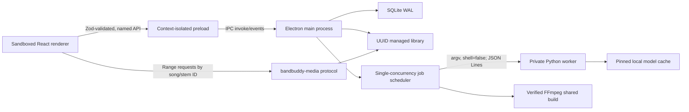

# BandBuddy desktop architecture

## Process boundary

主进程独占数据库、路径、对话框、任务、子进程、托盘和通知。renderer 禁用 Node 集成，不能获得分轨绝对路径；`bandbuddy-media://song/<song-id>/stem/<stem-id>` 只通过数据库 ID 解析受管资源并支持 Range。

Preload 只暴露 `library`、`tasks`、`runtime`、`settings`、`media`、`export` 与窗口控制。每个入参在 main 侧再次由 Zod 校验，IPC sender 必须是当前主窗口 main frame，开发态要求精确 origin，生产态要求精确 renderer 文件。

## Persistence and atomicity

SQLite 启用 WAL、foreign keys 与 busy timeout。迁移前复制数据库，按时间只保留三份。表包括 `songs`、`separation_runs`、`stems`、`practice_states`、`track_states`、`jobs`、`settings`。

处理结果先写 `<song>/.tasks/<job>/prepared`。六轨全部可探测、标准化并生成 peaks 后，目录才原子 rename 到 `versions/<uuid>`，最后事务切换 active separation；重分离失败时旧版本仍可用。启动时把未完成活动任务标为 `interrupted`，排队任务保留。

## Audio pipeline

内部音频统一为 44.1 kHz、stereo、24-bit FLAC。播放器为六个受控 `HTMLAudioElement`，经各自 MediaElementAudioSource 和 GainNode 汇入 master。Mute 优先于 Solo；存在任意未静音 Solo 时只播放这些 Solo。增益使用短斜坡，主轨时钟定期修正其余音轨漂移。

WaveSurfer 只绘制后台生成的 min/max peaks，不拥有播放时钟。六轨共享游标、缩放、滚动和 A–B 区间。练习状态 500 ms 防抖保存，播放中每 5 秒以及隐藏/页面切换时立即保存。

## Runtime and worker protocol

`worker.py` 每行输出一个含 `protocol: 1` 的 JSON 对象，类型为 `progress`、`result` 或 `error`。工作进程没有 HTTP 端口，不经过 shell。父进程取消任务时终止子进程并清理 `.tasks` 临时目录。

模型下载 marker 记录 repo、revision、哈希与文件绝对位置；每次加载再次校验文件仍位于 model root 且 SHA-256 相符。CUDA 选择需要 `nvidia-smi`、Torch `cuda.is_available()` 和张量自检共同通过。

## Export

标准分轨导出不应用练习增益。当前混音只选可听轨，按 dB 应用每轨和 master gain，可选 `atrim`/A–B、`atempo`/当前速度，最后用透明峰值 limiter 防削波。输出先写同目录 `.part` 文件，成功后 rename；所有子进程路径始终作为 argv 元素传递。
