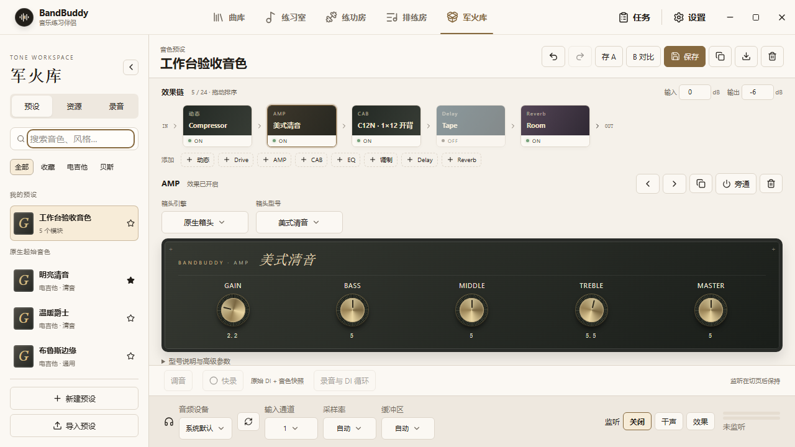

# 军火库工作台实现与验收

2026 年 10 月 5 日。本文记录本次军火库升级的软件实现、自动验证和仍需实机验证的边界。当前代码及原生宿主已完成构建，未制作安装包或发布新版本。

## 可用流程

从八个原生起始音色进入工作台，或新建最多 24 个独立模块的效果链。支持重复模块、拖动排序、键盘前后移动、复制、旁通和删除。设备面板只展示当前型号真正使用的参数；旋钮支持数字输入、键盘、Shift 精调和双击复位。滚轮仅修改已聚焦的旋钮，避免滚动页面时误调音色。

工作台保留当前草稿，提供撤销、重做、A/B 快照、用户预设、收藏、分类筛选、搜索及预设导入导出。切换预设可以通过撤销返回刚才的编辑状态。当前草稿持久化，撤销历史与 A/B 快照保留在本次应用会话内。导出的 bbtone 文件包含参数和资源哈希，不包含用户的 NAM 或 IR 文件；另一台电脑需先导入相同资源。

NAM 与 IR 均由用户导入，无下载服务或捆绑模型。批量导入独立处理每个文件，报告成功数量和失败文件。NAM 在入库前经过原生实例化及短段音频处理验证。缺失训练采样率时使用资源页明确选择的采样率。资源支持名称、标签、备注和模型内容标注；预设、草稿、录音引用中的资源不能直接删除。

监听在切页后保持，全局状态条可以返回军火库或停止监听。重新启动应用不自动开启输入。开启调音器后直接分析同一原生输入，并静音效果输出；伴奏仍可以播放。输入、输出电平、驱动与 DSP 报告延迟、DSP 回调负载和中断次数来自实际宿主数据。

快录把原始输入保存为 Float WAV，并保存开始时的效果链快照。停止快录不关闭监听。录音可选择最长 60 秒的片段循环调音、恢复录制时音色、导出 DI 或用当前音色导出效果声。湿声导出目前保留 5 秒尾音，不记录旋钮自动化或叠录。异常退出后可修复已写入的 WAV 头并恢复快录记录。

## 音频与数据结构

- `packages/shared/src/effect-catalog.ts` 集中定义型号、有效控件、参数显示范围与八个原生预设；共享 schema 继续校验实际数值范围。
- 持久化采用 v2 的 `id / type / revision / params` 模块格式，避免每个模块重复保存整条旧链。运行时通过适配器继续使用现有 native ABI。旧算法保留 revision 1，新建模块采用 revision 2。
- Renderer 的工作台 store 管理草稿、历史、A/B 和监听状态，页面卸载不销毁音频会话。保存结果不会覆盖请求期间的新编辑。
- 主进程串行处理监控和快录状态变更，原子写入工作台索引，缓存已解码的资源；预设和录音轨仍有各自独立的效果快照。
- 原生线程预分配处理缓冲，参数通过固定队列传递。图替换在控制线程构建，以发布指针和退休指针交接，切换时进行 20 ms 交叉淡化。新版 AMP、CAB、EQ 和动态旁通增加 5 ms 渐变。
- 原生动态处理加入软拐点、并行混合、立体声联动，以及带保持与滞回的门限；新增四段参数均衡、双 IR 电平与声像及延时/反相、乒乓延迟和八线反馈延迟网络的 Room/Hall。
- NAM 的输入修正与输出电平模式使用文件元数据。输入和输出分别填写接口的 dBu/FS 标定值，缺少所需字段时报告错误，不猜测。
- 练习伴奏在原有变速、变调、混音和限制器之后通过 AudioWorklet 取流。独立 IPC 通道将立体声包交给同一原生输出，回调中与输入监听相加。跨采样率使用带窗 sinc 转换；接收端有预缓冲。输出故障会尝试停止原生监听并恢复浏览器输出，音频包不写入诊断日志。
- 快录写盘在独立线程进行。离线湿声导出按块读取和处理，原始 DI 不被覆盖，源文件哈希也按流计算。

## 自动验证

| 验证 | 结果及范围 |
| --- | --- |
| TypeScript | `pnpm typecheck` 通过前后端检查 |
| 应用构建 | `pnpm exec electron-vite build` 通过；仍有项目既有的大 chunk 提示 |
| 原生宿主 | `node scripts/build-audio-host.mjs` 编译、安装到资源目录、自检及模拟声卡回归通过 |
| 相关测试 | 14 个测试文件，63 项通过、1 项跳过。跳过项依赖外部 `BB_NAM_TEST_MODEL`；合成 Linear 与 A2 NAM 导入实际执行了原生验证 |
| 新版 DSP | 实际 native exe 验证模块顺序、不同块大小、各型号输出、参数 EQ 的 Q、并行压缩、双 IR 混合与反相 |
| 原生快录 | 模拟设备验证干声文件、停止录制后续录、循环不改写原文件、调音静音、图切换及 44.1 kHz PCM 混入 48 kHz 输出 |
| 恢复与存储 | v1 到 v2 的参数保留、独立工厂副本、草稿/收藏恢复、损坏 WAV 长度头修复 |
| 页面 | Chromium 实际交互验证 A/B、撤销、保存、收藏、搜索、跨页监听和侧栏收放；无 pageerror |
| AudioWorklet | 在静音浏览器 sink 上实际运行；0.1 峰值测试信号产生约 20 个音频包，峰值 0.10000000149。此项主进程确认接口为测试替身；接收混音由独立原生测试验证 |

页面尺寸检查覆盖 1440×900、1280×720、1024×768，无整页横向溢出，底部设备栏均在视口内。1280×720 下常用箱头旋钮与底部监听栏同时可见。

## 设计对照

| 参考设计要点 | 实际落地 |
| --- | --- |
| 延续应用导航和浅色材质 | 保留现有应用 Header 与主题变量 |
| 预设、资源、录音分区 | 三个页内资料库标签，共用搜索与独立内容 |
| 明确的横向信号链 | 单行可横向滚动的设备卡，显示具体型号和旁通状态 |
| 中央器材面板 | 深色面板、金色旋钮、可编辑数字，普通和高级参数分层 |
| 固定操作与设备区域 | 页内滚动，快录/调音条和设备栏固定 |
| 小窗口可操作 | 720p 压缩标题、卡片及设备面板间距 |
| 真实状态反馈 | 未监听时不生成假电平；设备名称与电平来自 API |

概念图中的设备照片未用作控件；实际链卡使用代码绘制的材质与型号文字。全局状态条放在导航下方，避免与曲库播放器底栏重叠。

## 实机验证边界

原生箱头仍属于前级或结构近似，箱体仍是原有机电与辐射近似，Plate/Spring 也不是特定硬件的实测复刻。新增预设和算法尚未经过真实吉他、贝斯及参考硬件的匹配电平盲听，不能据自动测试宣称达到某款商业效果器的声音逼真度。

需要在目标声卡上验证 ASIO/WASAPI 的设备切换、单声道与立体声输入、44.1/48/96 kHz、64/128/256 帧缓冲、拔插恢复和长时间稳定性。界面的延迟是驱动报告值加 DSP 固定延迟，不包含实测 AD/DA；伴奏另有 AudioWorklet 分包与接收预缓冲，不能当作演奏输入延迟。当前统一伴奏输出为立体声，不提供原生多硬件输出总线。

本轮未执行实体声卡端到端听测，也未验证打包后的另一台 Windows 电脑运行。这些是发布验收的剩余项目。
